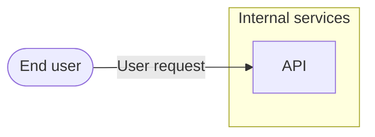

# Threat Model: [FEATURE NAME]

**Feature**: `[###-feature-name]` · **Generated**: [DATE] · **Profiles**: [stride, llm, agent] · **Canonical**: `threat-model.yaml`

> Rendered by ThreatSpec (`threatspec.sh render`). Edit `threat-model.yaml`, not this file.
> This template documents the layout the engine produces; it is the fallback when the engine cannot run.

## Summary

| Threats | Critical | High | Medium | Low | Mitigations | Requirements | Decisions |
|---|---|---|---|---|---|---|---|
| 0 | 0 | 0 | 0 | 0 | 0 | 0 | 0 |

## Actors

| ID | Name | Trust | Description |
|---|---|---|---|

## Trust Zones

| ID | Name | Trust rating | Description |
|---|---|---|---|

## Assets

| ID | Name | Type | Classification | C / I / A | Source |
|---|---|---|---|---|---|

## Components

| ID | Name | Type | Trust zone | Source |
|---|---|---|---|---|

## Data Flows

| ID | Name | From | To | Assets | Crosses |
|---|---|---|---|---|---|

## Threats

| ID | Threat | Category | Technique | Severity | Status | Mitigations | Mappings | Source |
|---|---|---|---|---|---|---|---|---|

### Techniques evaluated without findings

| Technique | Disposition | Reason |
|---|---|---|

## Mitigations

| ID | Mitigation | Kind | Threats | Requirements | Touchpoints | Status |
|---|---|---|---|---|---|---|

## Security Requirements

### SR-001 (P1) — unverified

[Statement]

- **Given** [precondition], **when** [action], **then** [outcome]
- Mitigations: `mitigation.example`
- Tasks: — none —

## Risk Decisions

| ID | Threat | Status | Owner | Expires | Rationale |
|---|---|---|---|---|---|
